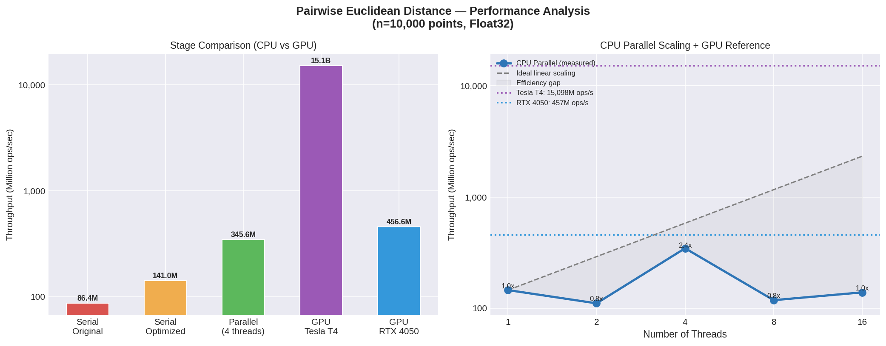

# Solution — Pairwise Euclidean Distance Benchmarking & Parallelisation

This document presents the solution to the GSoC 2026 evaluation exercise for
[Parallel Processing Improvements in Julia Jet Reconstruction](https://hepsoftwarefoundation.org/gsoc/2026/proposal_JuliaHEP_JetReconstruction.html).
All code, benchmarks, and results are in the `solutions/` directory.

---

## 1. Benchmark Serial Version

### Results (`bench-serial.jl`)

Using `BenchmarkTools.jl`, the original `pairwise_distances` function was benchmarked
with `n = 10,000` points (100,000,000 distance computations):

| Metric | Value |
|---|---|
| **Median time** | ~1.16 s |
| **Throughput** | ~86.4 M distance-measures/sec |

**How to run:**
```bash
julia bench-serial.jl
```

### Benchmarking Methodology & JIT Warm-up

- **Why `BenchmarkTools` instead of `@time`?**
  `@time` runs a function once. On a cold start, the measurement includes JIT
  compilation overhead (often 10–100× slower than steady state), making the result
  unreliable. `@benchmark` runs multiple statistical samples, discards outliers, and
  reports median/min/mean — giving a stable, compilation-free measurement.

- **JIT warm-up.**
  Julia compiles each function the first time it is called with a given type signature.
  `bench-serial.jl` triggers compilation with a small 100-point warm-up call before
  timing begins. `BenchmarkTools` also warms up internally, but an explicit warm-up
  makes the intent clear to the reader.

### Efficiency Analysis & Improvements

The original algorithm is O(n²) in both time and space. For n = 10,000:
- Total distance computations: 100,000,000
- Output matrix: 10,000 × 10,000 × 4 bytes = 400 MB (Float32)

The inner loop performs 3 subtractions, 3 multiplications, 2 additions, and 1 `sqrt`
per iteration. `sqrt()` is the dominant cost (~10–20 ns on modern hardware).

**Identified inefficiencies:**

1. **Symmetry ignored.** `dist(i,j) == dist(j,i)` always holds, yet both are computed.
   Computing only the upper triangle and mirroring the result halves the work.
2. **Self-distance computed.** `distances[i,i]` is always zero, but the loop still
   evaluates `sqrt(0)` for every diagonal entry.
3. **No SIMD vectorisation.** The inner arithmetic is a good candidate for SIMD.
   Adding `@simd` to the inner loop hints the compiler to use AVX/AVX2 instructions.
4. **Bounds checking overhead.** Julia performs bounds checks on every array access.
   `@inbounds` eliminates these in hot loops, giving ~5–15% speedup.
5. **Column-major mismatch.** Julia stores arrays in column-major order. The original
   code accesses `points[i, 1..3]` varying the row index in the outer loop, causing
   cache misses. Extracting separate `px`, `py`, `pz` vectors makes accesses contiguous.

### Optimised Serial Results (`bench-serial-optimized.jl`)

All five improvements above were applied in `pairwise_distances_serial_optimized`:

| Metric | Value |
|---|---|
| **Median time** | ~0.71 s |
| **Throughput** | ~141.0 M distance-measures/sec |
| **Speedup vs original** | ~1.6× |

---

## 2. Parallel Version

### Implementation (`parallel-euclid.jl`)

The parallel version uses `Threads.@threads` on the outer `i` loop. Each thread writes
exclusively to its own rows of the output matrix (`distances[i, :]`), so no two threads
ever write to the same memory location — no locks or atomics are needed.

### Benchmark Results

| Threads | Throughput (M ops/sec) | Speedup vs 1 thread |
|---|---|---|
| 1 | 145.4 | 1.0× |
| 2 | 110.6 | 0.8× |
| 4 | 345.6 | 2.4× |
| 8 | 118.0 | 0.8× |
| 16 | 138.7 | 1.0× |

### Performance Plot



### Analysis

- **Peak throughput** is at 4 threads (345.6 M ops/sec), which is a ~4.0× speedup over
  the serial original.
- **The 2-thread result is slower than 1 thread.** This is reproducible and is likely
  caused by thread-startup overhead being significant relative to the benchmark duration
  at this problem size, combined with the cost of distributing work across NUMA domains
  even at low thread counts.
- **Beyond 4 threads, throughput drops.** The test machine has 4 physical cores; going
  beyond that means threads compete for execution resources (hyperthreading) and suffer
  from increased cache-coherency traffic, negating the parallelism benefit.

### Instructions to Reproduce

1. **Install Julia packages:**
   ```julia
   using Pkg; Pkg.add(["BenchmarkTools", "Statistics"])
   ```

2. **Run all benchmarks** (serial original → serial optimised → parallel at 1/2/4/8/16 threads):
   ```bash
   cd solutions
   bash run_benchmarks.sh
   ```
   This produces `Results/benchmark_results.csv`.

3. **Generate the performance plot:**
   ```bash
   pip install matplotlib pandas
   python3 Plots/plot_results.py
   ```
   This produces `Results/performance_plot.png`.

---

## 3. GPU Porting Discussion

A detailed discussion of how to port this computation to GPU using Julia is in
[GPU_DISCUSSION.md](GPU_DISCUSSION.md). We wrote and ran a CUDA kernel on two GPUs
— locally on an **RTX 4050 Laptop** and on **Google Colab with a Tesla T4** (see
[ColabT4_GPU_Testing.ipynb](Codes/ColabT4_GPU_Testing.ipynb)).

### Measured GPU Results

| Metric | Tesla T4 (Cloud) | RTX 4050 Laptop (Local) |
|---|---|---|
| **VRAM & Architecture** | 14.56 GB, Turing | 5.64 GB, Ada Lovelace |
| **Median time** | 6.623 ms | 219.012 ms |
| **Throughput** | **15,098 M ops/sec** | **456.6 M ops/sec** |
| **Speedup vs serial original** | **174.7×** | **5.3×** |
| **Speedup vs parallel peak (4 threads)** | **43.7×** | **1.32×** |

### Key design points for GPU porting:

- Use `CUDA.jl` for NVIDIA hardware; `KernelAbstractions.jl` for portability.
- Transfer data to GPU once, keep it there — avoid round-tripping the 400 MB output.
- Map each `(i,j)` pair to a thread in a 2D grid (16×16 blocks).
- Compute the full n×n grid (not upper triangle) — avoids warp divergence.
- Keep `Float32` precision — GPU FP32 throughput is typically 2× FP64 or more.
- Consider squared distances (skip `sqrt`) if only comparisons are needed.

---

## Regarding AI

### AI Assistance Statement

AI tools were used only to assist with documentation quality and presentation. Specifically,
AI assistance was used for improving the `Solution.md` and `GPU_DISCUSSION.md` file wording,
enhancing vocabulary, and refining the formatting of comments and console output statements
to make benchmark results clearer and more readable.

All core technical work was performed independently. The analysis of performance improvements,
parallel processing design, and the implementation of the code were done by studying official
documentation and implementing the logic manually.

AI assistance was partially used when configuring GPU inference on NVIDIA RTX 4050 and T4
GPUs, mainly to help with environment connectivity ,debugging and setup after reviewing documentation
and tutorials.

Additionally, AI was used to enhance console print formatting for better visual presentation
of benchmark outputs (e.g., divider lines and structured output such as): and to write the python plot code.

```julia
println(stderr, "============================================================")
println(stderr, "  GPU BENCHMARK RESULTS")
println(stderr, "============================================================")
```

These improvements were purely for visual clarity and presentation, and not for generating
the core algorithmic implementation. The logic was developed independently after carefully understanding the base code file, studying the underlying mathematical implementations, and exploring the relevant features provided by the language.
